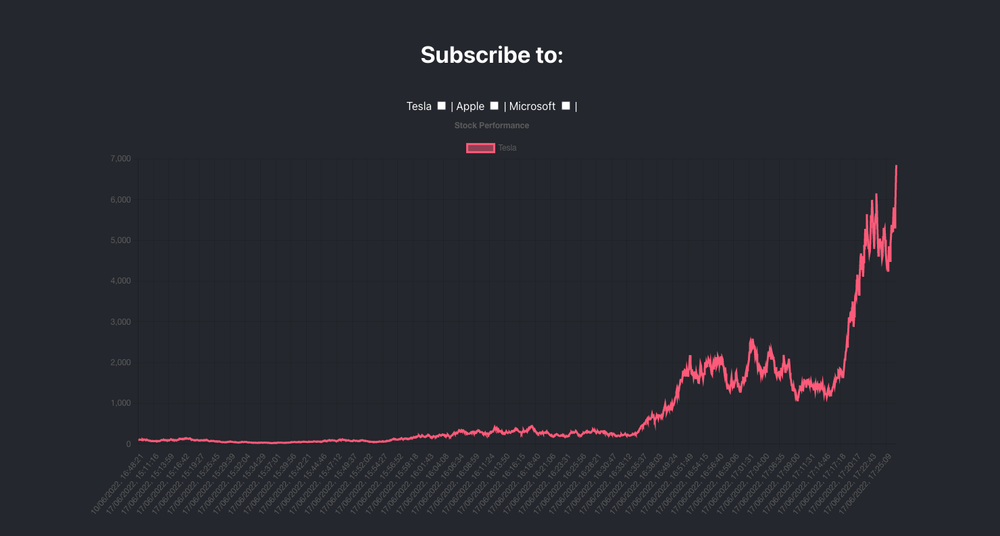

# Real Time Performance Graphs




Intend to build a client/server application that will subscribe to updates in a database. The client (React app) will show a graph of a performance of a particular stock, which will be web-socket-ed to an express/socket.io server.

The project contains:
- express/socket.io server - Node JS
- browser client - React JS
- database - MongoDB


### Starting the project
```
  docker-compose up
```

### Initial setup
Open a mongo client (like MongoDB Compass) and create a database called `data` and create a collection called `stock-prices`. In the collection create a single entry with the following data:

```
{
  "_id": {
    "$oid": "62a367fea1896809dbdb8246"
  },
  "price": 102,
  "stock": "Tesla",
  "recordedTime": {
    "$date": {
      "$numberLong": "1654876158604"
    }
  }
}
```